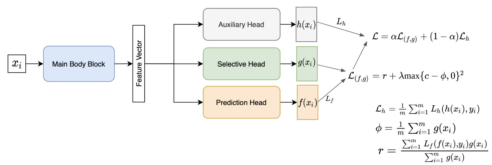

# SelectiveNet: A Pytorch Implementation

This is a PyTorch implementation of the paper titled SelectiveNet: A Deep Neural Network with an Integrated Reject Option (Geifman and El-Yaniv, ICML2019).

A deep neural network architecture with an integrated reject option that can be trained end-to-end for classification and regression tasks.

<p align="center">

</p>
   
## Requirements

Install requirements using `pip install -r requirements.txt`

I run the code with Pytorch 1.10.0, CUDA 10.2

## Usage
### Training
Use `scripts/train.py` to train the model. Example usage:
```bash
# Example usage
cd scripts
python train.py --dataset cifar10 --coverage 0.7 
```

### Testing
Use `scripts/test.py` to test the network. Example usage:
```bash
# Example usage (test single weight)
cd scripts
python test.py --dataset cifar10 --exp_id ${id_of_training_experminet} --weight ${name_of_saved_model}--coverage 0.7

# Example usage (test multiple weights)
cd scripts
python test.py --dataset cifar10 --exp_id 2fkl0ib7 --coverage 0.7
```

## References

- [Yonatan Geifman and Ran El-Yaniv. "SelectiveNet: A Deep Neural Network with an Integrated Reject Option.", in ICML, 2019.][1]
- [Original implementation in Keras][2]

[1]: https://arxiv.org/abs/1901.09192
[2]: https://github.com/geifmany/selectivenet
